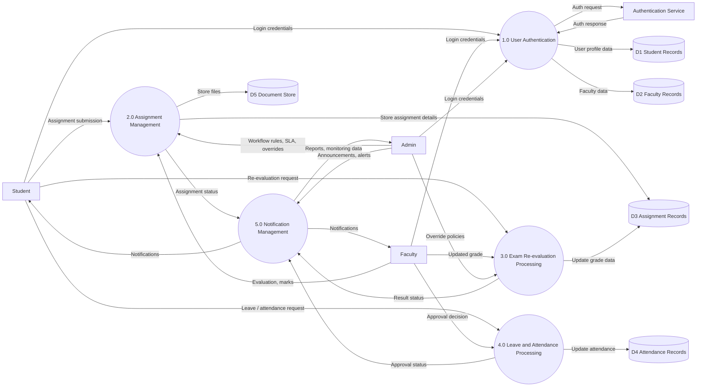

```mermaid
flowchart LR
    %% External Entities
    Student[Student]
    Faculty[Faculty]
    Admin[Admin]
    Auth["Authentication Service"]

    %% Processes
    P1(("1.0 User Authentication"))
    P2(("2.0 Assignment Management"))
    P3(("3.0 Exam Re-evaluation Processing"))
    P4(("4.0 Leave and Attendance Processing"))
    P5(("5.0 Notification Management"))

    %% Data Stores
    D1[(D1 Student Records)]
    D2[(D2 Faculty Records)]
    D3[(D3 Assignment Records)]
    D4[(D4 Attendance Records)]
    D5[(D5 Document Store)]

    %% Authentication
    Student -->|Login credentials| P1
    Faculty -->|Login credentials| P1
    Admin -->|Login credentials| P1
    P1 -->|Auth request| Auth
    Auth -->|Auth response| P1
    P1 -->|User profile data| D1
    P1 -->|Faculty data| D2

    %% Assignment Management
    Student -->|Assignment submission| P2
    Faculty -->|Evaluation, marks| P2
    Admin -->|Workflow rules, SLA, overrides| P2
    P2 -->|Store assignment details| D3
    P2 -->|Store files| D5
    P2 -->|Assignment status| P5

    %% Exam Re-evaluation
    Student -->|Re-evaluation request| P3
    Faculty -->|Updated grade| P3
    Admin -->|Override policies| P3
    P3 -->|Update grade data| D3
    P3 -->|Result status| P5

    %% Leave and Attendance
    Student -->|Leave / attendance request| P4
    Faculty -->|Approval decision| P4
    P4 -->|Update attendance| D4
    P4 -->|Approval status| P5

    %% Notifications and Monitoring
    Admin -->|Announcements, alerts| P5
    P5 -->|Notifications| Student
    P5 -->|Notifications| Faculty
    P5 -->|Reports, monitoring data| Admin
```