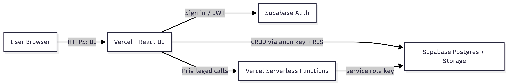

# CS 331 — Assignment 5

## Hosting & Deployment Plan

 Based on our chosen architecture: Modular Monolith (Layered) with Supabase (BaaS). This hosting choice meets the assignment goals by keeping deployment simple, reducing DevOps overhead, and allowing us to focus on core functionality.

---

## I. Where each component will be hosted

- **Frontend (UI — React pages/components)**
  - We will host the frontend on **Vercel** (automatic builds from GitHub).
- **Server-side / privileged logic**
  - We will implement privileged actions (assigning reviewers, sending emails, escalations) using **Vercel Serverless / Edge Functions** and keep service keys server-side.
- **Backend / Data**
  - We use **Supabase** for Auth, Postgres, Storage and Row Level Security (RLS).
- **Monitoring & error tracking (optional)**
  - We will use hosted tools such as **Vercel Analytics** and **Sentry**, and rely on Supabase logs for DB-level events.

---

## II. Deployment strategy — steps & policies

1. **Repository & CI/CD**

   - We push code to GitHub and connect the repository to **Vercel** for automatic deployments on the `main`/`production` branch.
   - We will use Vercel Preview Deploys for pull-request testing.

2. **Environment variables & secrets**

   - Client (public): `VITE_SUPABASE_URL`, `VITE_SUPABASE_ANON_KEY`. We will rotate these keys regularly and use separate values for preview, staging, and production environments to avoid accidental leaks.
   - Server (private): `SUPABASE_SERVICE_ROLE_KEY`, `SUPABASE_URL` — stored as Vercel Environment Secrets.

3. **Build & routing**

   - Build command: `npm run build`.
   - We will configure SPA routing.

4. **Database & Supabase setup**

   - We will create tables: `users`, `students`, `faculty`, `assignments`, `re_evals`, `attendance`, `notifications`, `event_logs`.
   - We will enable **Row Level Security (RLS)** and add role-specific policies for `student`, `faculty`, and `admin`.
   - We will create storage buckets (e.g., `assignments`) and define bucket policies.

5. **Serverless endpoints**

   - We will deploy serverless endpoints for elevated operations and call them from the frontend when needed (service role key used only server-side).

6. **Domain & HTTPS**

   - Domain, TLS/HTTPS is auto-managed by Vercel.

7. **Monitoring, rollback & backups**

   - We will use the Vercel deployments list for quick rollback.
   - We will enable Supabase backups / scheduled exports for the database.
   - We will monitor errors (Sentry) and metrics (Vercel / Supabase dashboards).

---

## Access Flow (diagram)

---

## Notes

- We follow **least privilege**: the client uses anon key + RLS; server functions use the service role key.
- We keep most logic client-side to reduce server cost; serverless is used only for sensitive operations.
- We use preview deploys for testing and run migrations carefully in CI.

---